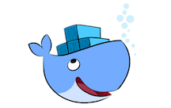

# Docker for Data Science

Containers have emerged in the Cloud and made it possible to utilize hardware infrastructure in the most flexible and efficient way. Containers make it possible to run whole application stacks from a single configuration file. The Institute of Data Science is already making use of this container infrastructure and we would like to share our knowledge.

First we will introduce Docker and how it is different from virtual machines with the help of examples. During the hands on sessions, you will learn how to use the “docker” command. We will also walk through troubleshooting by looking into log files and connecting into running containers to execute commands.

Finally the participants will create their own Docker images either from scratch or based on existing images. We will also look into building whole systems with docker-compose.

The target audience are UM staff who are dealing with IT infrastructure or any other Scientist with enthusiasm on Reproducible Science at [Maastricht University](https://www.maastrichtuniversity.nl/).

## Programme

| Time| Topic |
|--|--|
| 10:00 - 10:15| Introduction |
| 10:15 - 11:00| Docker Environment: How it is different from virtual machines?|
| 11:00 - 12:00| The “docker” command: Usage and troubleshooting|
| 12:00 - 13:00| Lunch Break|
| 13:00 - 14:30| Create your own Docker image|
| 14:30 - 15:00| Overview of orchestration frameworks, applications and discussion|

## Sources

- Installing [Docker](https://www.docker.com/) for [Mac](https://docs.docker.com/docker-for-mac/install/) and [Windows](https://docs.docker.com/docker-for-windows/install/download-docker-for-windows)

- Official Docker documentation [docs.docker.com](https://docs.docker.com/)

- Some more docker guides built by Docker enthusiasts like [eon01/DockerCheatSheet](https://github.com/eon01/DockerCheatSheet) or [wsargent/docker-cheat-sheet](https://github.com/wsargent/docker-cheat-sheet)

- In case you need to use existing images, in Docker Store you can find public, curated and official ones at [store.docker.com](https://store.docker.com/)

- Interesting blogs exploring funny and interesting applications of Docker
    - [5 cool and sometimes impractical things to do with Docker](https://blog.ssdnodes.com/blog/5-cool-and-sometimes-impractical-things-to-do-with-docker/)
    - [Reproducible Data Science with Docker](https://www.analyticsvidhya.com/blog/2017/11/reproducible-data-science-docker-for-data-science/)
    - [A curated list of Docker resources and projects](https://github.com/veggiemonk/awesome-docker)

- What is Docker in the words of its founder Solomon Hykes video [here](https://www.youtube.com/watch?v=3N3n9FzebAA)

## Acknowledgments

- [EDLAB Maastricht University](https://edlab.nl/)
- [Data Science Community @UM](https://www.maastrichtuniversity.nl/research/data-science-um/datascience-community)
- [Euregio Data Science Hub](https://arnoan.github.io/eu-dash/)